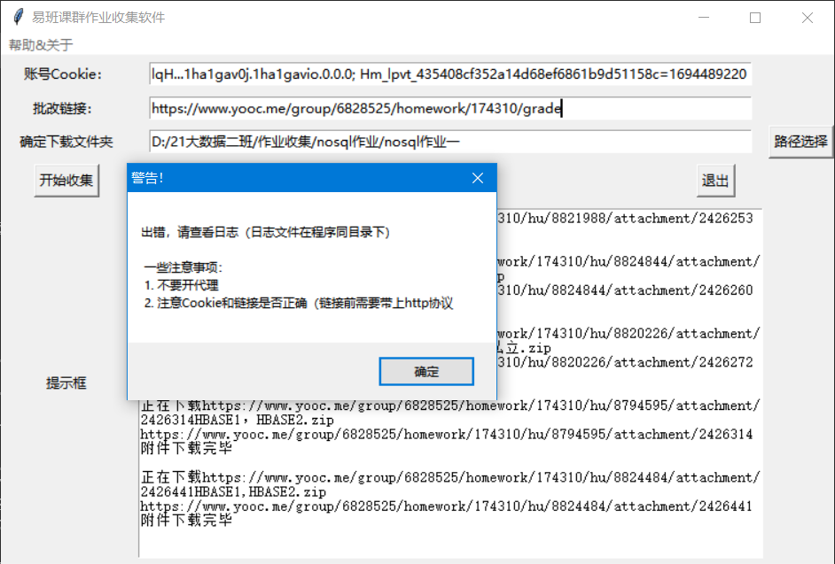

# 易班优课培训 —— 自动化作业下载

​																												—— 2023.9.12

## 使用教程（tutorial)

>  不要开代理，系统设置也要关掉代理。以管理员打卡程序

登录账号后任意界面（这里建议在课群页为例）右键检查 或者 按F12 键 打开面板

选择网络，刷新页面，点击第一项，复制Cookie中的字符串 （**就是账号Cookie**)

在优课作业截止后，**点击批改作业页面**，复制链接输入到exe中即可

如果报错请查看日志文件检查代理是否打开或者链接不正确(若遇到文件权限无法下载，需要重新删除对应附件下载或管理员运行)

## 开发

-  [x] 日志功能
-  [x] 智能报错
-  [x] refactor code 
-  [ ] 收集作业自动换页
-  [ ] 自动创建课群和自动获取课群码测试中

Github 地址：

https://github.com/TobeMagic/automatic-yiban-tools
